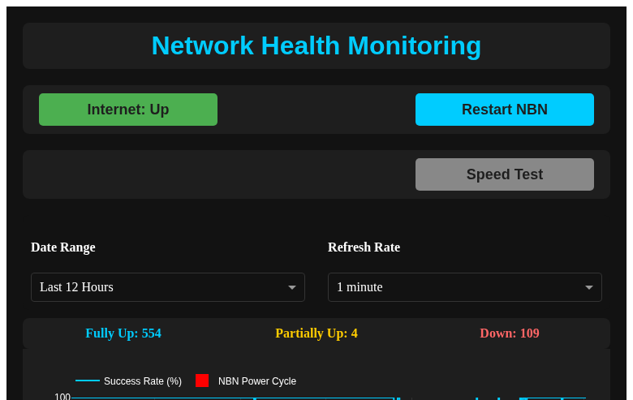

# Containerized Network Monitor Dashboard

This project provides a containerized solution for monitoring internet connectivity and managing a network device (specifically, a Tapo smart plug connected to an NBN modem/router).

## Dash Web App Interface



## Features

- **Internet Connectivity Monitoring:** Continuously checks internet status by pinging external servers and logs the results (success rate, latency, packet loss) to an SQLite database.
- **Web Dashboard:** A web interface built with Dash displays real-time and historical internet connectivity data. It includes graphs for success rate, latency, and packet loss, and a detailed log table.
- **Automated Power Cycling (Tapo):** Automatically power cycles a configured Tapo smart plug if internet connectivity is lost for a sustained period (5 consecutive failures).
- **Manual Power Cycling (Tapo):** Provides a button on the web dashboard to manually trigger a power cycle of the configured Tapo smart plug. This button is enabled only if Tapo credentials are set and a connection to the device can be established.
- **Redis Caching:** Utilizes Redis for caching dashboard data to improve performance.

## Getting Started

These instructions will get you a copy of the project up and running on your local machine.

### Prerequisites

- Docker and Docker Compose installed on your system.
- A Tapo smart plug connected to your network, with its IP address, email, and password known.

### Installation and Setup

1.  **Clone the repository:**
    ```bash
    git clone <your-repository-url>
    cd local-network-monitor-dashboard
    ```

2.  **Configure Tapo Credentials:**
    Create a `.env` file in the project root directory (or set them directly in your environment or `docker-compose.yml` for production) with your Tapo device details:

    ```
    TAPO_EMAIL=your_tapo_email
    TAPO_PASSWORD=your_tapo_password
    TAPO_DEVICE_IP=your_tapo_device_ip
    TAPO_DEVICE_NAME="Your Device Name"
    ```
    *Note: `TAPO_DEVICE_IP` should be the local IP address of your Tapo smart plug.*

3.  **Build and Run with Docker Compose:**
    Navigate to the project root directory and run:
    ```bash
    docker-compose up --build -d
    ```
    This command will:
    - Build the Docker image for the network monitor.
    - Create and start the `local-network-monitor-container`.
    - Run `supervisord` inside the container to manage the internet checking script and the web dashboard.

### Accessing the Dashboard

The dashboard will be accessible in your web browser at `http://localhost:8050`.

## Usage

- The dashboard displays the current internet status (Up, Partially Up, or Down) and historical data through interactive graphs and a detailed log table.
- The "Restart NBN" button allows for manual power cycling of your NBN modem/router via the Tapo smart plug. This button will be greyed out and disabled if the Tapo credentials are not correctly configured or if the device cannot be reached.

## Project Structure

- `Dockerfile`: Defines the Docker image for the application.
- `docker-compose.yml`: Orchestrates the Docker container setup and defines environment variables.
- `requirements.txt`: Lists Python dependencies, including `dash[async]` for asynchronous operations and `tapo` for Tapo device control.
- `supervisord.conf`: Configures `supervisord` to manage the `check_internet.sh` script and the `internet_status_dashboard.py` application.
- `check_internet.sh`: A shell script that periodically checks internet connectivity and logs status to an SQLite database. It also triggers automated power cycles.
- `internet_status_dashboard.py`: The main Dash application that provides the web dashboard and handles manual power cycle requests.
- `power_cycle_nbn.py`: Python script executed by `check_internet.sh` to perform automated power cycling of the Tapo device.
- `power_cycle_nbn_override.py`: Python script executed by the dashboard to perform manual power cycling of the Tapo device.

## Important Considerations

- **Tapo Credentials:** Ensure your `TAPO_EMAIL`, `TAPO_PASSWORD`, `TAPO_DEVICE_IP`, and `TAPO_DEVICE_NAME` environment variables are correctly set in your `docker-compose.yml` or `.env` file. The functionality of the "Restart NBN" button and automated power cycling depends on these being valid and the device being reachable.
- **Logging:** The system logs internet status and power cycle events to an SQLite database (`logs/internet_status.db`) and to the container's standard output. Review these logs for operational insights and troubleshooting.
