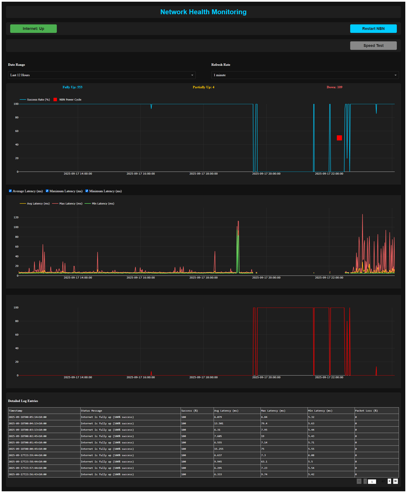

# Containerized Internet Monitor with Dash & Tapo Power Cycling

[](https://www.python.org/) [](https://www.docker.com/) [](https://dash.plotly.com/)

This project provides a self-contained, easy-to-deploy solution for monitoring your internet connectivity. It periodically pings external targets, logs the results to an SQLite database, and visualizes the data on a web dashboard.

If the connection is down for a sustained period, it can automatically power cycle your modem/router using a TP-Link Tapo smart plug. The entire system is packaged into a single Docker container, making setup incredibly simple.

-----

## ✨ Features

  * 📊 Interactive Web Dashboard: Visualize internet health with real-time graphs for uptime, latency, and packet loss using a Plotly Dash interface.
  * 🤖 Automated Power Cycling: Automatically reboots your modem via a Tapo P100 smart plug after 5 consecutive failed checks.
  * 👆 Manual Override: A "Restart NBN" button on the dashboard allows you to trigger a power cycle manually at any time.
  * 🚀 Simple Docker Setup: Get up and running with a single `docker-compose up` command. No need to manually install any dependencies.
  * 🗄️ SQLite Logging: All connectivity data is logged to an SQLite database within the container.

-----

## 📊 Web Dashboard Interface



-----

## 🚀 Quickstart

Getting the monitor running is simple. You just need Docker and Docker Compose installed.

### 1. Prerequisites

  * Docker: https://docs.docker.com/get-docker/
  * Docker Compose: https://docs.docker.com/compose/install/

### 2. Clone the Repository

```bash
git clone https://github.com/famesjranko/network-monitoring-dashboard.git
cd network-monitoring-dashboard
```

### 3. Configure Docker Compose

Copy the example environment file and edit it with your settings:

```bash
cp .env.example .env
# then open .env and set values as needed
```

The included `docker-compose.yml` wires everything up using `.env` and persists both logs and the SQLite database via volumes:

```yaml
services:
  redis:
    image: redis:7-alpine
    container_name: local-network-redis
    restart: unless-stopped
    healthcheck:
      test: ["CMD", "redis-cli", "ping"]
      interval: 10s
      timeout: 3s
      retries: 10
    volumes:
      - redis-data:/data

  local-network-monitor:
    image: network-monitor:latest
    build: .
    container_name: local-network-monitor
    restart: unless-stopped
    depends_on:
      redis:
        condition: service_healthy
    ports:
      - "8050:8050"
    env_file:
      - .env
    volumes:
      - ./logs:/app/logs
      - ./data:/app/data

volumes:
  redis-data:
```

Notes:
- `INTERNET_CHECK_TARGETS` and `FAILURE_THRESHOLD` work independently of Tapo and are always respected.
- If you're not using a Tapo smart plug, leave the Tapo-related variables unset in `.env`.
- Assign a static IP address to your Tapo plug via your router's DHCP settings for stable communication.

---

### 4. Build and Run the Container

From the project's root directory, launch the application:

```bash
docker-compose up --build -d
```

### 5. Access the Dashboard

Open your web browser and navigate to:

http://localhost:8050

(Replace `localhost` with the IP address of your host machine if you're accessing it from another device on your network).

-----

## 🏗️ System Architecture

This project runs as two containers managed by Docker Compose:

- `redis`: an external Redis 7 container used purely for caching.
- `local-network-monitor`: the application container based on Python 3.11-slim.

Inside the application container, `supervisord` manages two processes:
1) Monitoring script (`scripts/check_internet.sh`) running every minute.
2) Dash web app (`internet_status_dashboard.py`) served via Gunicorn on port 8050.

Additional details:
- Health endpoint: the app exposes `GET /health`; the Docker image defines a `HEALTHCHECK` against it.
- Redis is cache-only (no persistence) and can be scaled independently if desired.

-----

## 🔧 Configuration

### Environment Variables

Set these in `.env` (the compose file uses `env_file: .env`). Tapo-related variables are optional — if not set or invalid, the “Restart NBN” button is disabled and automatic power cycling is skipped.

| Variable | Default | Description |
| -------------------------- | ------------------------------------------ | ----------- |
| `INTERNET_CHECK_TARGETS`   | `8.8.8.8,1.1.1.1,9.9.9.9`                  | Comma-separated list of IPs to ping; used for badge and logging. |
| `FAILURE_THRESHOLD`        | `5`                                        | Consecutive failed minutes before automatic power cycle. |
| `DISPLAY_TZ`               | `UTC`                                      | Timezone for displaying timestamps in the UI. |
| `DB_PATH`                  | `/app/data/internet_status.db`             | Path to SQLite DB inside the container. |
| `LOG_DIR`                  | `/app/logs`                                | Directory for runtime logs and counters. |
| `REDIS_URL`                | `redis://redis:6379/0`                     | Redis connection URL for caching (compose service `redis`). |
| `PING_COUNT_PER_TARGET`    | `5`                                        | Number of pings per target per minute in the checker. |
| `PING_TIMEOUT`             | `2`                                        | Ping timeout (seconds) per probe. |
| `RETENTION_DAYS`           | `14`                                       | Days of history to keep in SQLite; older rows are pruned. |
| `VACUUM_INTERVAL_RUNS`     | `720`                                      | Maintenance cycle interval (runs) before VACUUM/WAL checkpoint. |
| `TAPO_EMAIL`               | —                                          | Tapo account email (required for smart plug control). |
| `TAPO_PASSWORD`            | —                                          | Tapo account password. |
| `TAPO_DEVICE_IP`           | —                                          | Static IP address of your Tapo plug (reserve via DHCP). |
| `TAPO_DEVICE_NAME`         | —                                          | Friendly name used in logs/UI. |
| `TAPO_COOLDOWN_SECONDS`    | `3600`                                     | Cooldown (seconds) between allowed modem reboots. |

Notes:
- `INTERNET_CHECK_TARGETS` applies regardless of Tapo usage.
- The “Restart NBN” button is only enabled when a Tapo connection succeeds.

#### .env Reference

Copy `.env.example` to `.env` and set keys as needed. Common entries:
- INTERNET_CHECK_TARGETS: Comma-separated IPs to ping (e.g., `1.1.1.1,8.8.8.8`).
- FAILURE_THRESHOLD: Minutes of full failure before auto power cycle (default `5`).
- DISPLAY_TZ: UI timezone (e.g., `Australia/Sydney`).
- DB_PATH: SQLite DB path (default `/app/data/internet_status.db`).
- LOG_DIR: Directory for runtime logs and counters (default `/app/logs`).
- REDIS_URL: Redis URL for caching (default `redis://redis:6379/0`).
- PING_COUNT_PER_TARGET: Pings per target (default `5`).
- PING_TIMEOUT: Ping timeout in seconds (default `2`).
- RETENTION_DAYS: Days of history to keep (default `14`).
- VACUUM_INTERVAL_RUNS: Runs between DB maintenance (default `720`).
- TAPO_EMAIL / TAPO_PASSWORD / TAPO_DEVICE_IP / TAPO_DEVICE_NAME: Credentials and device info for Tapo.
- TAPO_COOLDOWN_SECONDS: Cooldown between power cycles in seconds (default `3600`).

-----

## ⚙️ Usage and Management

### Checking Logs

To view the real-time logs from the application (including ping results and errors), run:

```bash
docker-compose logs -f local-network-monitor
```

### Stopping the Application

To stop the container, run:

```bash
docker-compose down
```

### ⚠️ Data Persistence

The compose file mounts two host directories for persistence by default:
- `./data` -> `/app/data` (SQLite database)
- `./logs` -> `/app/logs` (runtime logs and counters)

Keep these mappings to ensure history survives restarts and `docker-compose down`.

-----

## 🧰 Local Development

Run the app locally without Docker:

```bash
pip install -r requirements.txt
export DISPLAY_TZ=UTC  # optional; choose your TZ
python3 internet_status_dashboard.py
```

Populate the SQLite database with sample data by running the checker once:

```bash
bash scripts/check_internet.sh
```

For best caching performance, run a local Redis (`redis-server`) or leave defaults; the app falls back gracefully if cache errors occur.

-----

## 🔌 Power Cycling Behavior

- Manual: The dashboard button triggers `power_cycle_nbn_override.py` and logs a “manually triggered” power cycle event.
- Automatic: `check_internet.sh` runs every minute and calls `power_cycle_nbn.py` after `FAILURE_THRESHOLD` consecutive full failures. The action respects `TAPO_COOLDOWN_SECONDS` to avoid rapid repeats.
